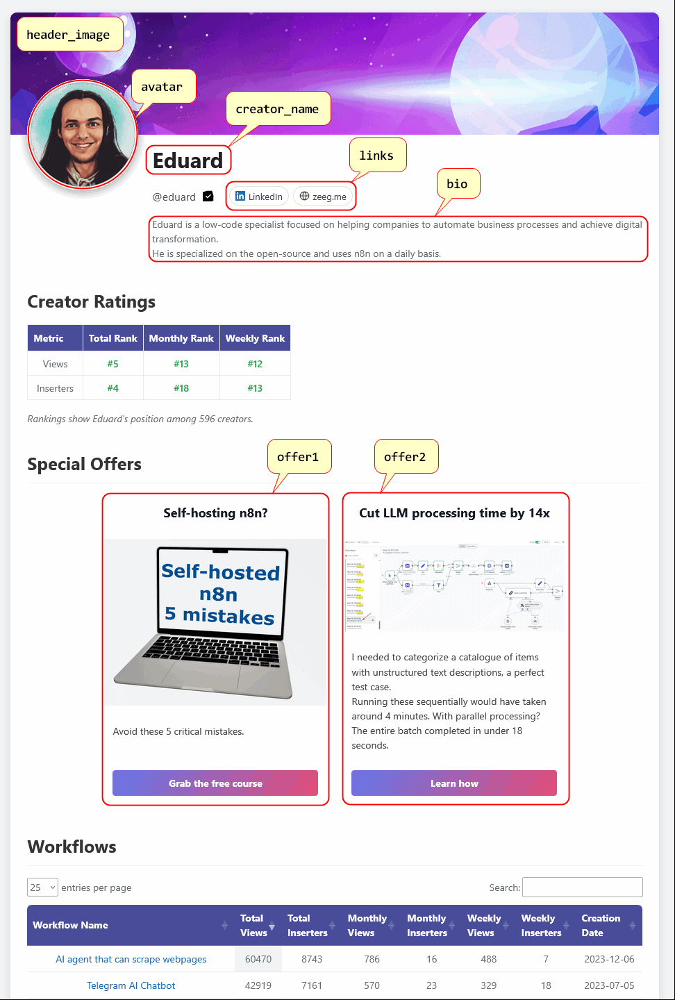

# n8narena - Community Leaderboard

A community-led initiative showcasing the top n8n creators and their workflow templates.

## About

This leaderboard recognizes contributions from n8n creators, provides visibility to their templates, and fosters healthy competition and collaboration within the community.

## Features

- Creator rankings based on workflow usage and engagement
- Monthly challenges to encourage quality contributions
- Transparent data sourcing from n8n's official API
- Community-driven updates and verification

## Claim Your Creator Page

Are you an n8n workflow template creator? You can now claim and customize your creator page! Add your own bio, social links, header images, and promotional offers.

### How to Claim Your Page

1. **Find your creator page** on n8narena
2. **Fork this repository**
3. **Customize your creator file** in `_creators/[your-username]/[your-username].md` (file already exists, just needs your personal touch)
4. **Submit a pull request** with your customized information
5. **Send a DM on LinkedIn** to [Eduard](https://www.linkedin.com/in/parsadanyan/) to confirm you are claiming your own page

For detailed instructions and examples, see the [Creator Page Guide](#creator-page-customization) below.

## Creator Page Customization

When customizing your creator page, you'll work with a YAML front matter structure. Here's what you can customize:

### Required Fields (Do Not Change)

```yaml
layout: creator_page
# Required: Username for the creator (used for URL and data lookup)
creator_username: "eduard"
```

⚠️ **Important**: Keep `layout` and `creator_username` exactly as they are. These are required for the page to function properly.

### Optional Customization Fields

#### Basic Information
- **`creator_name`**: Override your display name (by default taken from your n8n creator profile)
- **`avatar`**: Override your profile picture (by default taken from your n8n creator profile)
- **`bio`**: Update your biography. By default taken from your n8n creator profile, but you can customize it as a single string with HTML tags like `<br>` for line breaks.

#### Visual Styling
- **`header_image`**: Add a custom header background image. Place your image file in `/_creators/[your-username]/` directory (e.g., `/_creators/eduard/banner.jpg`)
- **`header_gradient`**: Choose a background gradient. Possible options: `ocean`, `sunset`, `forest`, `golden`, `twilight`. Note: This will be hidden when `header_image` is provided

#### Social Links
- **`links`**: Add your social media and website links. You can include more than 2 links:
```yaml
links: ["https://www.linkedin.com/in/yourprofile/","https://yourweb.site"]
```

### Bonus: Promotional Offers

If you have courses, services, or other offerings, you can showcase up to 2 promotional sections under `offer1` and/or `offer2`

<details>
<summary>Click to expand the example</summary>

```yaml
offer1:
  title: "Self-hosting n8n?"
  image: "/assets/img/preview-mini-course.png"
  description: "Avoid these 5 critical mistakes."
  link: "https://mini-course.parsedventures.com/"
  cta: "Grab the free course"

offer2:
  title: "Cut LLM processing time by 14x"
  image: "/_creators/eduard/offer.png"
  description: "I needed to categorize a catalogue of items with unstructured text descriptions, a perfect test case.<br>Running these sequentially would have taken around 4 minutes. With parallel processing? The entire batch completed in under 18 seconds."
  link: "https://www.linkedin.com/feed/update/urn:li:activity:7330245571351359489/"
  cta: "Learn how"
```

</details>

Each offer can include:
- `title`: Catchy headline for your offer
- `image`: Image file (place in your creator directory)
- `description`: Brief description (HTML tags supported)
- `link`: URL to your offer
- `cta`: Call-to-action button text

### Complete Example

See `_creators/eduard/eduard.md` for a complete example of a customized creator page.

<details>
<summary>Click to expand the visual example</summary>



</details>

*Example of a customized creator page with header image, bio, social links, and promotional offers*
